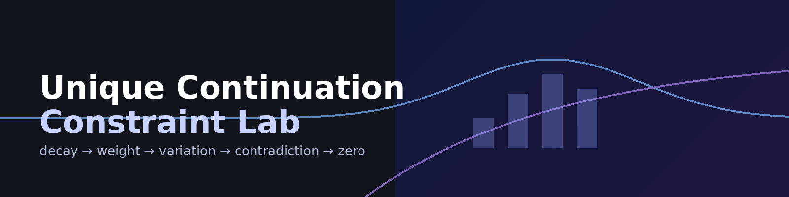

# unique-continuation-constraint-lab

Constraint-based visualization and notebooks for unique continuation in Schrödinger equations.

**same math · lifted clarity**

---

## 🔗 Start here

- 🌐 **Web bridge note**  
  https://cosineconstraint.app/colab/2026_04_24_schrodinger_unique_continuation_pipeline.html

- 📄 **Paper (PDF)**  
  https://cosineconstraint.app/colab/papers/unique-continuation-constraint-lab/main.pdf

- 📓 **Notebooks (Colab)**  
  - Notebook 01 — Decay + Carleman  
    https://colab.research.google.com/github/thinkthoughts/unique-continuation-constraint-lab/blob/main/notebooks/01_decay_weight_visualization.ipynb  
  - Notebook 02 — Hardy variation  
    https://colab.research.google.com/github/thinkthoughts/unique-continuation-constraint-lab/blob/main/notebooks/02_hardy_gate_demo.ipynb  
  - Notebook 03 — PDE-aligned contradiction  
    https://colab.research.google.com/github/thinkthoughts/unique-continuation-constraint-lab/blob/main/notebooks/03_contradiction_pipeline.ipynb  

---

## Pipeline

```text
two-time decay
→ Carleman weight
→ Hardy-type inequality
→ contradiction
→ zero solution
```

This repo turns an after-seminar bridge into a reproducible structure:

- figures  
- notebooks  
- paper scaffold  

No new mathematics is claimed. The goal is to preserve the standard proof structure while making the pipeline easier to inspect and reproduce.

---

## Core mathematical context

\[
i\partial_t u = -\Delta u + V(x)u.
\]

Two-time decay assumption:

\[
|u(x,t_1)|, |u(x,t_2)| \le C e^{-a|x|^2}.
\]

Conclusion under standard hypotheses:

\[
u(x,t) \equiv 0.
\]

---

## Figures

Representative steps:

- Step 1 — two-time decay  
- Step 2 — exponential / Carleman weighting  
- Step 3 — Hardy variation cost  
- Step 4 — contradiction alignment  
- Step 5 — zero solution  

(see `/figures/`)

---

## Repo structure

```
unique-continuation-constraint-lab/
  paper/
  notebooks/
  src/
  figures/
  docs/
```

---

## Docs

- 📘 Glossary  
  docs/glossary.md  

- 🔄 AB ↔ NOW alignment  
  docs/AB_NOW_alignment.md  

---

## Language note

This repo includes a minimal CGCS translation layer:

- **expand**: initial spread of structure  
- **extend (step)**: continue one step  
- **resist (collapse)**: continues under constraint pressure  

These are interpretive aids only. Standard PDE language remains primary.

---

## Current status

- [x] web bridge note  
- [x] notebook pipeline (01–03)  
- [x] figure set  
- [x] paper draft (PDF)  
- [ ] arXiv-ready version  
- [ ] expanded references  

---

**same math · lifted clarity**
